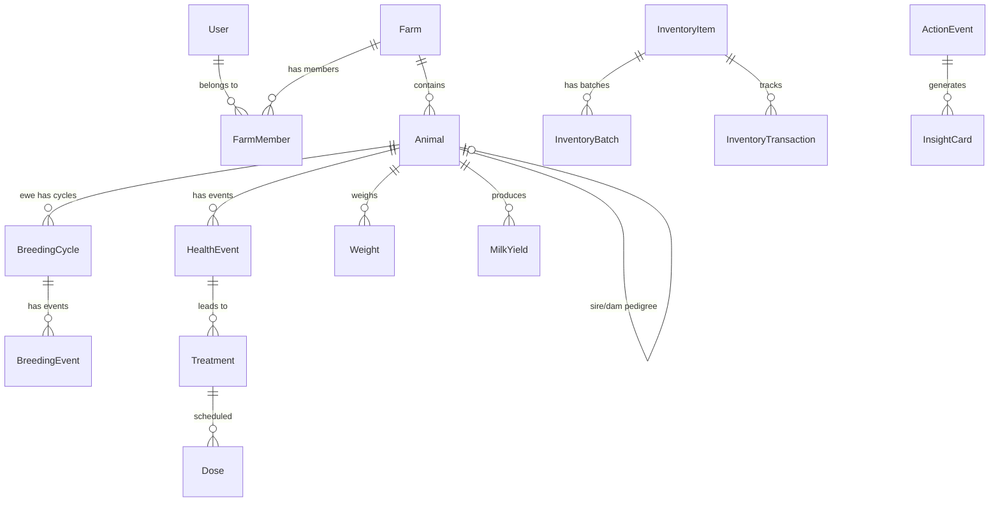
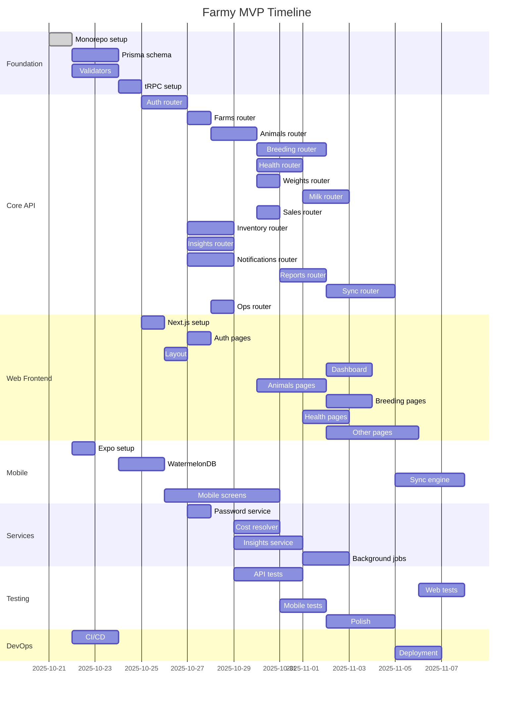

# Farmy TS Monorepo — MVP Build Plan

_Repository scan date: October 18, 2025_

**Files scanned from ./farmy-guide/:**
- API_Guide.md
- Backend_Implementation_Guide.md
- Mobile_Implementation_Guide.md
- Frontend_Implementation_Guide.md
- System_Technical_Spec.md
- Business_Requirements_Document.md
- Business_Requirements_Document_Full.md
- Cursor_Prompts.md
- openapi.yaml
- FarmApp_MVP_AllSpecs_Merged.pdf
- Backend_Tech_Spec_SpringBoot_DO.pdf
- ewe_pregnancy_flow.pdf

---

## 1. Executive Summary

### Who Farmy Serves
Farmy is a **mobile-first, offline-first farm management system** for Palestinian small-to-medium sheep farms. These family-operated farms face limited land, rely on purchased feed, and currently track operations via paper notes or WhatsApp—leading to missed breeding checks, poor cost visibility, and no actionable insights.

### Top 6 MVP Capabilities
1. **Breeding & Pregnancy Management**: Track INS1/INS2, pregnancy checks (28d, 45-50d), gestation periods (150d), due dates, and lambing events with automated reminders
2. **Health & Treatment Tracking**: Record diagnoses, treatments, doses with withdrawal period enforcement (milk/meat), and post-lambing supplement protocols (Oxy, Ceftanel)
3. **Weight & Feed Management**: Batch weight entry, ADG calculations, lamb milk feeding tracking (0-35d: nursing vs manufactured), and feed plan management
4. **Milk & Sales Recording**: Daily milk yields, milk sales with withdrawal flagging, animal sales (live/slaughter/cull) with revenue tracking
5. **Inventory & Cost Tracking**: Best-effort cost resolver with confidence badges (Batch/FIFO → Last Known Price → Catalog → Derived → Fuzzy → Reference → Zero), supplier management, and nightly backfill
6. **Insights & Causality Analysis**: Relate actions (shearing, supplier change, ration change, protocol shifts, pen moves) to outcomes (ADG, milk, sickness, conception) using pre/post uplift, DiD, change-point detection, and lagged correlation (1-21d)

### Clearly Out-of-Scope (MVP)
- Grazing/pasture planning and rotation management
- Advanced accounting and tax preparation
- Hardware integrations beyond optional RFID scanners
- Government API integrations
- Task manager with work orders
- Sensor integrations (scales, weather stations)
- AI-powered hints and recommendations
- Email-based authentication or OTP via SMS

---

## 2. Requirements Traceability Matrix

| Feature ID | Feature | Source File(s) | Acceptance Criteria |
|------------|---------|----------------|---------------------|
| FARMY-MVP-001 | Phone/Password Authentication | System_Technical_Spec.md §3, API_Guide.md §1 | Register/login with phone (unique) + password, Argon2id hashing, JWT access (30min) + refresh (30d) tokens, refresh-token rotation |
| FARMY-MVP-002 | Multi-Farm Support | System_Technical_Spec.md §3, Business_Requirements_Document.md §2 | User can join multiple farms with per-farm roles (Owner/Admin/Worker/Vet), switch farms via header X-Farm-Id |
| FARMY-MVP-003 | RBAC | System_Technical_Spec.md §3 | Roles: Owner, Admin, Worker, Vet, Super-Admin; farm-scoped permissions; audit trail |
| FARMY-MVP-004 | Animal Records | Business_Requirements_Document.md §4.1, openapi.yaml | CRUD animals with numeric tag (unique per farm), optional RFID (15 digits), type (RAM/EWE/LAMB), sex, DOB, sire/dam links, status (ACTIVE/SOLD/DEAD/CULLED) |
| FARMY-MVP-005 | Tag Configuration | System_Technical_Spec.md §5 | Farm settings: type ↔ color map, numbering format, uniqueness rules; UI warns on mismatch with override + reason |
| FARMY-MVP-006 | Breeding Cycles | Business_Requirements_Document.md §4.1, ewe_pregnancy_flow.pdf | Record INS1/INS2, checks (≥28d, ~45-50d), gestation 150d (or 167d if INS2 conception), due windows, lambing with litter details, losses |
| FARMY-MVP-007 | Breeding Reminders | System_Technical_Spec.md §7.1 | Auto-generate: INS2 (+17d), CK1 (+28d), CK2 (+47-50d), lambing prep (7d before), overdue alerts |
| FARMY-MVP-008 | Health Events | Business_Requirements_Document.md §4.2, openapi.yaml | Record diagnosis, treatments (drug/dose/route/freq/duration), vaccines, supplements; track withdrawal periods (milk/meat) |
| FARMY-MVP-009 | Dose Tracking | System_Technical_Spec.md §7.2 | Schedule doses, mark given/skipped/overdue, send reminders; batch apply to herds with per-animal exceptions |
| FARMY-MVP-010 | Weights & ADG | Business_Requirements_Document.md §4.3 | Batch weight entry, calculate ADG, alert on under/over-weight thresholds by age/sex |
| FARMY-MVP-011 | Lamb Feeding | System_Technical_Spec.md §7.3 | Track 0-35d feeding: Nursing vs Manufactured milk with volume |
| FARMY-MVP-012 | Milk Yields | Business_Requirements_Document.md §4.4, openapi.yaml | Record per-ewe yields or daily totals; flag discarded if in withdrawal |
| FARMY-MVP-013 | Milk Sales | openapi.yaml | Record volume × price, track buyer (optional), calculate revenue |
| FARMY-MVP-014 | Animal Sales | Business_Requirements_Document.md §4.4, openapi.yaml | Record sale (live/slaughter/cull), weight (optional), price, buyer (optional) |
| FARMY-MVP-015 | Pedigrees | Business_Requirements_Document.md §4.5 | Link sire/dam, show pedigree tree, warn on inbreeding risk |
| FARMY-MVP-016 | Lamb Selection Scoring | Business_Requirements_Document.md §4.6, System_Technical_Spec.md §7.5 | Score lambs: Growth (0-40) + Dam (0-30) + Sire (0-20) + Health (0-10); recommend ≥70, neutral 50-69; allow override with reason |
| FARMY-MVP-017 | Inventory Items | System_Technical_Spec.md §7.7 | Manage items (name, category, unit, reorder level), suppliers, batches (batch code, cost, expiry) |
| FARMY-MVP-018 | Inventory Transactions | System_Technical_Spec.md §7.7 | Record PURCHASE/USAGE/ADJUSTMENT/WASTE with quantity, cost value/source/confidence |
| FARMY-MVP-019 | Cost Resolver | System_Technical_Spec.md §7.7 | Resolve costs: Batch/FIFO → Last Known → Catalog → Derived → Fuzzy → Reference → Zero; persist confidence (HIGH/MEDIUM/LOW); nightly backfill |
| FARMY-MVP-020 | Action Events | System_Technical_Spec.md §7.8 | Record shearing, supplier change, ration change, protocol shift, pen move with date and affected animal IDs |
| FARMY-MVP-021 | Metric Snapshots | System_Technical_Spec.md §7.8 | Nightly ETL: capture metric values (ADG, milk, conception rate) by cohort and date |
| FARMY-MVP-022 | Insights & Causality | System_Technical_Spec.md §7.8 | Methods: pre/post uplift, DiD, change-point, lag scan (1-21d); output InsightCard (effect %, lag, window, confidence); allow Confirm/Mute |
| FARMY-MVP-023 | Reminders | System_Technical_Spec.md §8 | Generate reminders for breeding, health, low stock, expiry; dispatch every 10min via scheduler |
| FARMY-MVP-024 | Notifications | System_Technical_Spec.md §8 | Push (FCM) + in-app inbox; triggers: lambing, preg result, dose due/overdue, milk discarded, sales posted; per-member subscriptions |
| FARMY-MVP-025 | Farm Dashboard | Business_Requirements_Document.md §4.7 | Show herd size, pregnant ewes, due windows, sick animals, milk sold, animal sales, profit estimate |
| FARMY-MVP-026 | Cross-Farm Dashboard | Business_Requirements_Document.md §4.7, System_Technical_Spec.md §1 | Owner view: per-farm cards + aggregated totals with date filters |
| FARMY-MVP-027 | Exports | Business_Requirements_Document.md §4.11, System_Technical_Spec.md §9 | CSV/XLSX export for Animals, Events, Sales, KPIs, Costs (+confidence); localized headers, ISO dates |
| FARMY-MVP-028 | Imports | System_Technical_Spec.md §9 | CSV templates with preview, row-level errors/warnings, idempotency by (farmId, externalRowId) |
| FARMY-MVP-029 | Offline-First Mobile | System_Technical_Spec.md §6, Mobile_Implementation_Guide.md | WatermelonDB local store, outbox pattern, background sync (push/pull), LWW conflict resolution |
| FARMY-MVP-030 | Sync Contract | System_Technical_Spec.md §6, API_Guide.md §3 | Pull: GET /sync/pull?since=ISO → entities + tombstones + serverTime; Push: POST /sync/push with clientMutationId; 409 on conflict |
| FARMY-MVP-031 | Super-Admin Ops | System_Technical_Spec.md §3 | Create farms/users, assign roles, impersonate (view-only), full audit log |
| FARMY-MVP-032 | Audit Trail | System_Technical_Spec.md §3 | Log all actions: userId, farmId, action, entityType, entityId, IP, timestamp |
| FARMY-MVP-033 | RTL Support | System_Technical_Spec.md §1, Frontend_Implementation_Guide.md | Arabic + English with RTL direction toggle, bidirectional layouts |
| FARMY-MVP-034 | Attachments | System_Technical_Spec.md §4 | Upload photos/docs to S3-compatible storage, presigned URLs, metadata in DB |

---

## 3. User Stories & Acceptance (Gherkin)

### Key User Stories (Selected)

**US-001: Phone/Password Registration and Login**
```gherkin
Feature: Phone/Password Authentication
  Scenario: Successful Registration
    Given I provide phone "+970591234567" and password
    When I submit registration form
    Then my password is hashed with Argon2id
    And I receive JWT access token (30min) and refresh token (30d)
    And I'm directed to farm selection

  Scenario: Successful Login
    Given I'm a registered user with phone "+970591234567"
    When I enter correct phone and password
    Then I receive JWT tokens
    And I can access the app

  Scenario: Token Refresh
    Given my access token is expired
    When I send valid refresh token
    Then I receive new access token
    And refresh token is rotated for security
```

**US-002: Record Breeding Event**
```gherkin
Feature: Breeding Cycle Tracking
  Scenario: Record INS1
    Given I select ewe "E101"
    When I record INS1 on "2025-01-15"
    Then new breeding cycle is created
    And INS2 reminder set for "2025-02-01" (+17d)
    And Check1 reminder set for "2025-02-12" (+28d)
  
  Scenario: Calculate Due Date
    Given ewe has positive Check1
    When conception confirmed
    Then due date = INS1 + 150 days 
    And lambing prep reminder = due - 7 days
```

**US-003: Batch Weight Entry**
```gherkin
Feature: Weight Recording
  Scenario: Batch Entry
    Given I'm on Batch Weights screen
    When I enter multiple animals with weights
    Then all weights saved to outbox
    And ADG calculated if previous weight exists
    And under-weight alerts shown
```

**US-004: Treatment with Withdrawal**
```gherkin
Feature: Health Treatment
  Scenario: Record Treatment
    Given I select animal "A001"
    When I record treatment with milk withdrawal until "2025-03-20"
    Then doses are scheduled
    And milk from "A001" flagged DISCARD until withdrawal end
  
  Scenario: Prevent Milk Sale During Withdrawal
    Given animal in withdrawal
    When I try to sell milk from that animal
    Then I see error "Cannot sell milk during withdrawal"
```

**US-005: Offline Sync**
```gherkin
Feature: Offline Data Capture
  Scenario: Record Event Offline
    Given no internet connection
    When I record lambing event
    Then event stored in local DB
    And added to outbox
  
  Scenario: Auto-Sync on Connectivity
    Given I have events in outbox
    When internet restored
    Then background sync pushes changes
    And server IDs mapped to local records
    And outbox cleared
```

### Edge Cases Covered
- Duplicate phone numbers (prevent with unique constraint error)
- Weak passwords (enforce minimum strength requirements)
- Offline capture + sync conflicts (LWW resolution)
- Invalid weight cadence (ADG calculation handles gaps)
- Inventory below reorder level (alert + notification)
- Med withdrawal periods (enforce in milk/meat sales)
- Multi-farm roles (permissions enforced per operation)
- Tag color mismatch (warn + allow override with audit)
- Inbreeding detection (warn when mating close relatives)
- Gestation calculation ambiguity (INS2 fallback logic)
- Overdue pregnancy checks (reminder escalation)

---

## 4. Domain Model & ERD

### Core Entities

**Identity & Access**
- User (id, phone, passwordHash, name?, createdAt, updatedAt)
- Farm (id, name, ownerId, settings, createdAt, updatedAt)
- FarmMember (id, farmId, userId, role, joinedAt)
- SuperAdmin (userId, grantedAt)

**Animals & Breeding**
- Animal (id, farmId, tagNumber, rfid?, type, sex, status, dob?, sireId?, damId?, createdAt, updatedAt)
- BreedingCycle (id, eweId, farmId, ins1Date, ins2Date?, check1Date?, check1Result?, check2Date?, check2Result?, conceptionDate?, dueStart?, dueEnd?, estDue?, status, createdAt, updatedAt)
- BreedingEvent (id, cycleId, eweId, farmId, type, date, payload, createdBy, createdAt)

**Health**
- HealthEvent (id, animalId, farmId, type, date, diagnosisCode?, payload, createdBy, createdAt)
- Treatment (id, healthEventId?, animalId, farmId, drug, dose, route, frequency, duration, startDate, withdrawalMilkEnd?, withdrawalMeatEnd?, lot?, expiry?, createdBy, createdAt, updatedAt)
- Dose (id, treatmentId, animalId, scheduledAt, givenAt?, givenBy?, notes?, status, createdAt, updatedAt)

**Weight & Feed**
- Weight (id, animalId, farmId, date, kg, method, notes?, recordedBy, createdAt)
- FeedPlan (id, farmId, name, components, ratios, startDate?, endDate?, createdBy, createdAt, updatedAt)
- LambFeeding (id, lambId, farmId, method, startDate, endDate?, volumePerDay?, notes?, createdAt, updatedAt)

**Milk & Sales**
- MilkYield (id, animalId, farmId, at, liters, recordedBy, createdAt)
- MilkSale (id, farmId, date, volumeLiters, pricePerLiter, buyerName?, totalRevenue, createdBy, createdAt)
- AnimalSale (id, animalId, farmId, date, type, weightKg?, price, buyerName?, createdBy, createdAt)

**Inventory**
- InventoryItem (id, farmId, name, category, unit, reorderLevel?, supplierId?, createdAt, updatedAt)
- InventoryBatch (id, itemId, farmId, batchCode, quantity, unitCost, purchaseDate, supplierId?, expiryDate?, createdAt)
- InventoryTransaction (id, itemId, farmId, type, quantity, batchId?, costValue?, costSource?, confidence?, date, notes?, createdBy, createdAt)
- Supplier (id, farmId, name, phone?, notes?, createdAt, updatedAt)

**Insights**
- ActionEvent (id, farmId, type, date, affectedAnimalIds[], payload?, createdBy, createdAt)
- MetricSnapshot (id, farmId, metricType, value, date, cohort?, createdAt)
- InsightCard (id, farmId, actionEventId?, title, narrative, effectPercent?, lagDays?, windowStart?, windowEnd?, confidence, status, createdAt, updatedAt)

**Notifications & Sync**
- Reminder (id, farmId, type, dueDate, targetEntityId?, status, createdBy, createdAt, updatedAt)
- NotificationInbox (id, userId, farmId?, type, title, body, targetEntityId?, read, createdAt)
- DeviceToken (id, userId, token, platform, createdAt, lastUsed)
- Tombstone (id, farmId, entity, entityId, deletedAt, deletedBy)
- AuditLog (id, userId, farmId?, action, entityType?, entityId?, ipAddress?, userAgent?, createdAt)
- Attachment (id, farmId, entityType, entityId, filename, mimeType, sizeBytes, storageKey, uploadedBy, createdAt)

### Entity Relationship Diagram (Mermaid)



### Key Design Notes
1. **Farm Scoping**: All entities have `farmId` for multi-tenancy
2. **Pedigree**: Self-referential `Animal` with `sireId`/`damId`
3. **Soft Deletes**: `Tombstone` table for offline sync
4. **Confidence Costing**: `InventoryTransaction` stores cost + confidence level
5. **RFID**: Optional 15-digit field on `Animal`
6. **Authentication**: Phone as unique identifier, passwordHash stored with Argon2id

---

## 5. API Design (tRPC-first)

### tRPC Router Structure

**Auth Router** (`auth`)
```typescript
auth.register({ phone, password, name? }) => { accessToken, refreshToken, user }
auth.login({ phone, password }) => { accessToken, refreshToken, user }
auth.refreshToken({ refreshToken }) => { accessToken, refreshToken }
auth.logout({ refreshToken }) => { success: boolean }
```

**Farms Router** (`farms`)
```typescript
farms.list() => Farm[]
farms.get({ id }) => Farm
farms.create({ name }) => Farm
farms.members.list({ farmId }) => FarmMember[]
farms.members.invite({ farmId, phone, role }) => FarmMember
```

**Animals Router** (`animals`)
```typescript
animals.list({ farmId, q?, status?, type?, cursor?, limit }) => Paginated<Animal>
animals.get({ id, farmId }) => Animal
animals.create(CreateAnimalInput) => Animal
animals.update(UpdateAnimalInput) => Animal
animals.delete({ id, farmId }) => { success } // Soft delete
animals.search({ farmId, q }) => Animal[]
```

**Breeding Router** (`breeding`)
```typescript
breeding.cycles.list({ farmId, status?, cursor?, limit }) => Paginated<BreedingCycle>
breeding.cycles.get({ id, farmId }) => BreedingCycle
breeding.events.create(CreateBreedingEventInput) => BreedingEvent
breeding.reminders.due({ farmId, daysAhead }) => Reminder[]
```

**Health Router** (`health`)
```typescript
health.events.create(CreateHealthEventInput) => HealthEvent
health.treatments.create(CreateTreatmentInput) => Treatment
health.doses.record({ doseId, givenAt, notes? }) => Dose
health.withdrawal.check({ farmId, animalIds }) => WithdrawalStatus[]
```

**Additional Routers**: weights, milk, sales, inventory, insights, notifications, reports, sync, ops

### Middleware & Auth
- `publicProcedure`: No auth (register, login endpoints)
- `protectedProcedure`: JWT required (decode/verify access token)
- `farmProcedure`: JWT + farm membership validated
- `superAdminProcedure`: JWT + SuperAdmin role

### Error Codes
- `BAD_REQUEST`: Invalid input (Zod)
- `UNAUTHORIZED`: Missing/invalid JWT
- `FORBIDDEN`: Insufficient permissions
- `NOT_FOUND`: Entity doesn't exist
- `CONFLICT`: Sync conflict (stale data)

### Pagination
Cursor-based with `{ items: T[], nextCursor?: string }`

### Idempotency
Mobile mutations include `clientMutationId` for deduplication

---

## 6. Web Frontend (Next.js)

### App Structure
```
apps/web/src/app/
├── (auth)/          # Login, register
├── (app)/           # Main app with layout
│   ├── dashboard/
│   ├── animals/     # List, detail, CRUD
│   ├── breeding/    # Cycles, events
│   ├── health/      # Events, treatments, withdrawal
│   ├── weights/     # Batch entry, charts
│   ├── milk/        # Yields, sales
│   ├── sales/       # Animal sales
│   ├── inventory/   # Items, batches, transactions
│   ├── insights/    # Insight cards
│   ├── reports/     # Dashboards, exports
│   ├── settings/    # Farm settings, members
│   └── ops/         # Super Admin
└── api/
    ├── trpc/[trpc]/ # tRPC adapter
    └── auth/[...]   # NextAuth
```

### Key Technologies
- **Next.js 15**: App Router, Server Components
- **Chakra UI**: RTL-ready components
- **tRPC**: Type-safe API calls
- **React Query**: Data fetching & caching
- **React Hook Form + Zod**: Form validation
- **next-intl**: i18n (Arabic/English)

### Data Fetching Pattern
```typescript
const { data } = trpc.animals.list.useQuery({ farmId, limit: 50 })
```

### Form Pattern
```typescript
const form = useForm({ resolver: zodResolver(createAnimalInputSchema) })
const { mutate } = trpc.animals.create.useMutation()
```

### RTL Support
- Chakra theme with direction toggle
- `<html dir={locale === 'ar' ? 'rtl' : 'ltr'}>`

---

## 7. Mobile (Expo/React Native)

### Quick-Capture Flows
- Add Lambing
- Record Treatment
- Batch Weights
- Record Milk
- Sell Animal
- Sync Now

### Offline Storage (WatermelonDB)
```javascript
// SQLite schema for offline data
tables: [
  'animals', 'breeding_cycles', 'health_events',
  'weights', 'milk_yields', 'sales', 'outbox'
]
```

### Background Sync
```javascript
// Push outbox changes
POST /sync/push with clientMutationId

// Pull server changes
GET /sync/pull?since=lastSyncedAt

// Conflict resolution: LWW (server wins)
```

### RFID Scanner (Optional)
- Bluetooth Serial adapter
- Scan 15-digit RFID → lookup animal

---

## 8. AuthN/AuthZ & Security

### Authentication
- **Phone/Password**: Phone as unique username, password hashed with Argon2id
- **JWT**: Access 30min, Refresh 30d with rotation
- **Storage**: Web (memory/HttpOnly cookie), Mobile (SecureStore)
- **Password Requirements**: Minimum 8 characters, complexity enforced

### Authorization (RBAC)
- **Roles**: Owner, Admin, Worker, Vet, Super-Admin
- **Scoping**: All operations scoped by `farmId`
- **Enforcement**: tRPC middleware validates membership + JWT decode/verify

### Security Measures
- Rate limiting on auth endpoints
- HTTPS only
- Secrets in environment variables
- Audit log for all mutations
- Presigned URLs for attachments
- Argon2id for password hashing (resistant to GPU attacks)
- Refresh token rotation on each use

---

## 9. Data & Migration Plan (Prisma + PostgreSQL)

### Database
- **PostgreSQL 15+**
- **Prisma ORM**: Type-safe queries
- **Migrations**: `prisma migrate dev`

### Schema Highlights
- 30+ models covering all domains
- Indexes on `(farmId, updatedAt)`, `(farmId, tagNumber)`, date ranges
- Unique constraint on `User.phone`
- `User.passwordHash` stores Argon2id hashed passwords
- Soft deletes via `Tombstone` table
- JSON fields for flexible data (settings, payloads)

### Initial Migration
```bash
prisma migrate dev --name init
```

### Seed Data
- Sample farms, users (with hashed passwords), animals
- Reference data: breeds, vaccines, feed types

---

## 10. Offline & Sync Readiness

### Mobile Offline Strategy
- **Local DB**: WatermelonDB (SQLite)
- **Outbox Pattern**: Queue mutations with `clientMutationId`
- **Background Sync**: Expo BackgroundFetch (every 15min)
- **Conflict Resolution**: Last-Write-Wins (server `updatedAt` wins)
- **Tombstones**: Handle deleted records

### Sync Boundaries
- Per-farm data isolation
- Delta sync by `updatedAt` timestamp
- Batch size: 500 records per request

### Web PWA (Future)
- Service worker for offline shell
- IndexedDB cache (phase 2)

---

## 11. Non-Functional Requirements

### Performance
- API P50 < 300ms
- Animal list < 300ms @ 5k items (with indexes)
- Mobile list 2k animals @ 60fps
- Background sync ≤ 2min/session

### Availability
- 99.5% uptime target (MVP)
- Managed database backups (daily)
- Weekly logical dump to object storage

### Scalability
- Horizontal scaling for API (stateless)
- PostgreSQL read replicas (phase 2)
- Redis for rate limiting (optional)

### Security
- JWT rotation
- Rate limits per endpoint
- No PII in logs
- GDPR-ready data export
- Argon2id password hashing

### i18n
- Arabic + English
- RTL support in Chakra UI
- Localized date/number formats

---

## 12. Testing Strategy

### API Tests (Vitest)
- Unit tests for services
- Integration tests with test DB
- Fixtures for common scenarios
- Test Argon2id hashing/verification

### Web Tests
- Component tests (React Testing Library)
- E2E smoke tests (Playwright)
- Test key flows: login, create animal, record event

### Mobile Tests (Optional)
- Unit tests for sync logic
- Detox for critical paths

### Coverage Target
- 70%+ for API routers
- 60%+ for UI components

---

## 13. Monorepo Structure (Turborepo + PNPM)

```
farmy/
├── apps/
│   ├── web/          # Next.js (TS, App Router, Chakra, tRPC)
│   └── mobile/       # Expo (TS, RN, WatermelonDB)
├── packages/
│   ├── api/          # tRPC routers
│   ├── db/           # Prisma schema + client
│   ├── validators/   # Zod schemas
│   ├── auth/         # NextAuth + RBAC + Argon2id helpers
│   ├── ui/           # Chakra theme + components
│   ├── config/       # Shared configs (TS, ESLint, Prettier)
│   └── utils/        # Shared utilities
├── turbo.json        # Build pipeline
├── pnpm-workspace.yaml
└── package.json
```

### Scripts
- `pnpm dev`: Start all apps
- `pnpm build`: Build for production
- `pnpm db:generate`: Generate Prisma client
- `pnpm db:migrate`: Run migrations
- `pnpm lint`, `pnpm type-check`

### Path Aliases
```json
"@farmy/api": "workspace:*"
"@farmy/db": "workspace:*"
"@farmy/validators": "workspace:*"
```

---

## 14. Work Breakdown Structure (WBS)

| ID | Task | Owner | Estimate (h) | Dependencies | DoD |
|----|------|-------|--------------|--------------|-----|
| **Phase 1: Foundation** |
| 1.1 | Monorepo setup (Turborepo + PNPM) | Dev | 4 | - | Scripts run, packages link |
| 1.2 | Prisma schema (all 30 models) | Dev | 16 | 1.1 | Schema valid, migration runs, User.phone unique, passwordHash field |
| 1.3 | Zod validators (all domains) | Dev | 12 | - | Schemas export, types inferred, password validation |
| 1.4 | tRPC setup + middleware | Dev | 8 | 1.2, 1.3 | Context, JWT auth middleware, decode/verify work |
| **Phase 2: Core API** |
| 2.1 | Auth router (Register/Login/Refresh) | Dev | 16 | 1.4 | Register/login/refresh/logout work with Argon2id |
| 2.2 | Farms router | Dev | 8 | 2.1 | CRUD + members management |
| 2.3 | Animals router | Dev | 12 | 2.2 | CRUD, search, soft delete |
| 2.4 | Breeding router | Dev | 20 | 2.3 | Cycles, events, reminders, gestation calc |
| 2.5 | Health router | Dev | 16 | 2.3 | Events, treatments, doses, withdrawal |
| 2.6 | Weights router | Dev | 8 | 2.3 | CRUD, batch entry, ADG calc |
| 2.7 | Milk router | Dev | 10 | 2.3, 2.5 | Yields, sales, withdrawal check |
| 2.8 | Sales router | Dev | 6 | 2.3 | Animal sales CRUD |
| 2.9 | Inventory router | Dev | 16 | - | Items, batches, transactions, cost resolver |
| 2.10 | Insights router | Dev | 12 | - | Action events, insight cards |
| 2.11 | Notifications router | Dev | 10 | - | Inbox, subscriptions, device tokens |
| 2.12 | Reports router | Dev | 12 | All above | Dashboard, cross-farm, exports |
| 2.13 | Sync router | Dev | 20 | All above | Pull/push, conflicts, tombstones |
| 2.14 | Ops router (Super Admin) | Dev | 8 | 2.1, 2.2 | Farms/users mgmt, audit |
| **Phase 3: Web Frontend** |
| 3.1 | Next.js setup + providers | Dev | 8 | 1.4 | tRPC, Chakra, NextAuth work |
| 3.2 | Auth pages (login, register) | Dev | 8 | 2.1, 3.1 | Phone/password flow works |
| 3.3 | Layout (nav, farm switcher) | Dev | 8 | 3.1 | Responsive, RTL-ready |
| 3.4 | Dashboard page | Dev | 12 | 2.12, 3.3 | KPIs, charts display |
| 3.5 | Animals pages (list, detail, forms) | Dev | 20 | 2.3, 3.3 | CRUD works, search, filters |
| 3.6 | Breeding pages | Dev | 16 | 2.4, 3.3 | Cycles list, events timeline |
| 3.7 | Health pages | Dev | 16 | 2.5, 3.3 | Treatments, doses, withdrawal |
| 3.8 | Weights page (batch entry) | Dev | 8 | 2.6, 3.3 | Batch form, charts |
| 3.9 | Milk pages | Dev | 10 | 2.7, 3.3 | Yields, sales |
| 3.10 | Sales page | Dev | 6 | 2.8, 3.3 | Record sales |
| 3.11 | Inventory pages | Dev | 12 | 2.9, 3.3 | Items, batches, transactions |
| 3.12 | Insights page | Dev | 8 | 2.10, 3.3 | Cards grid, confirm/mute |
| 3.13 | Reports pages | Dev | 10 | 2.12, 3.3 | Dashboard, export |
| 3.14 | Settings pages | Dev | 10 | 2.2, 3.3 | Farm settings, members, tags |
| 3.15 | Ops pages (Super Admin) | Dev | 8 | 2.14, 3.3 | Farms/users mgmt |
| **Phase 4: Mobile App** |
| 4.1 | Expo setup + navigation | Dev | 8 | - | Basic screens, nav works |
| 4.2 | WatermelonDB schema | Dev | 12 | 1.2 | Schema matches API, queries work |
| 4.3 | Sync engine (push/pull) | Dev | 24 | 2.13, 4.2 | Background sync, conflicts |
| 4.4 | Auth screens | Dev | 8 | 2.1, 4.1 | Phone/password flow, SecureStore |
| 4.5 | Home screen (quick CTAs) | Dev | 8 | 4.1 | Navigation works |
| 4.6 | Animals screens (list, detail) | Dev | 12 | 4.2, 4.5 | Offline queries, search |
| 4.7 | Record lambing flow | Dev | 10 | 4.2, 4.5 | Offline capture, sync |
| 4.8 | Record treatment flow | Dev | 10 | 4.2, 4.5 | Offline capture, sync |
| 4.9 | Batch weights flow | Dev | 8 | 4.2, 4.5 | Offline capture, sync |
| 4.10 | Record milk flow | Dev | 6 | 4.2, 4.5 | Offline capture, sync |
| 4.11 | Record sale flow | Dev | 6 | 4.2, 4.5 | Offline capture, sync |
| 4.12 | Tasks/reminders screen | Dev | 8 | 4.2 | Display, mark complete |
| 4.13 | Simple reports screen | Dev | 6 | 4.2 | Today/7d basics |
| 4.14 | RFID scanner (optional) | Dev | 12 | 4.6 | Bluetooth adapter, mock |
| **Phase 5: Services & Jobs** |
| 5.1 | Password hashing service | Dev | 4 | 2.1 | Argon2id hash/verify |
| 5.2 | Cost resolver service | Dev | 16 | 2.9 | Batch/FIFO → fallbacks |
| 5.3 | Insights calculation service | Dev | 24 | 2.10 | Pre/post, DiD, change-point, lag |
| 5.4 | Reminders dispatcher (cron) | Dev | 12 | 2.11 | Every 10min, breeding/health |
| 5.5 | Metric snapshots ETL (nightly) | Dev | 12 | 2.10 | ADG, milk, conception |
| 5.6 | Insights impact scan (nightly) | Dev | 16 | 5.3 | Generate insight cards |
| 5.7 | Cost backfill (nightly) | Dev | 10 | 5.2 | Upgrade confidence |
| 5.8 | Notification service (FCM) | Dev | 12 | 2.11 | Push to devices |
| **Phase 6: Testing & Polish** |
| 6.1 | API tests (Vitest) | Dev | 20 | Phase 2 | 70% coverage, test auth flow |
| 6.2 | Web component tests | Dev | 16 | Phase 3 | Key components |
| 6.3 | E2E tests (Playwright) | Dev | 12 | Phase 3 | Smoke tests |
| 6.4 | Mobile sync tests | Dev | 10 | Phase 4 | Offline scenarios |
| 6.5 | Bug fixes & polish | Dev | 20 | All | No critical bugs |
| 6.6 | Performance optimization | Dev | 12 | All | Meet NFRs |
| **Phase 7: DevOps & Docs** |
| 7.1 | CI/CD pipeline | DevOps | 12 | - | Lint, test, build, deploy |
| 7.2 | Environment setup (staging) | DevOps | 8 | - | DB, Redis (optional), S3, FCM |
| 7.3 | Deployment docs | DevOps | 4 | 7.1, 7.2 | README complete |
| 7.4 | User docs | PM | 8 | Phase 6 | Guides for key flows |

**Total Estimate**: ~590 hours (~15 weeks @ 40h/week or ~4-6 weeks with team)

---

## 15. Timeline (Mermaid Gantt)



**Total Duration**: 6-8 weeks with 2-3 developers

---

## 16. Risk Log & Mitigations

| Risk | Probability | Impact | Trigger | Mitigation | Owner |
|------|-------------|--------|---------|------------|-------|
| RFID scanner hardware variability | Medium | Low | Different device protocols | Abstract bluetooth interface, provide mock adapter | Dev |
| Offline sync conflicts frequent | Medium | Medium | Multiple users editing same animal | Implement LWW clearly, show toast on conflict, audit trail | Dev |
| React Native scanning reliability | Medium | Medium | Barcode/RFID unreliable | Provide manual entry fallback, test on real devices | Dev |
| RTL layout regressions | Low | Medium | Complex Chakra components | Test all pages in AR locale, use Chakra RTL tokens | Dev |
| Inventory/costing accuracy questioned | Medium | High | Users distrust confidence badges | Show clear confidence labels, document resolver logic, allow manual override | PM + Dev |
| PostgreSQL performance with 10k+ animals | Low | Medium | Slow queries | Index (farmId, updatedAt), (farmId, tagNumber), use EXPLAIN, add read replica | Dev |
| Weak password choices | Medium | Medium | Users choose simple passwords | Enforce password complexity, provide strength indicator | Dev |
| Insights generate false positives | Medium | Medium | Statistical noise | Require min sample size, allow "Mute", clear confidence levels | Dev |
| Mobile background sync battery drain | Low | Medium | User complaints | Configurable sync interval, respect battery saver mode | Dev |
| NextAuth JWT rotation complexity | Low | Low | Token expires mid-operation | Implement refresh interceptor, retry failed requests | Dev |

---

## 17. Open Questions & Assumptions

### Open Questions
1. **Password Requirements**: What minimum complexity? (Assume: 8+ chars, mix of letters/numbers recommended)
2. **RFID Scanner Model**: Specific Bluetooth device model? (Assume: generic HID/Serial protocol, provide mock)
3. **Attachment Storage**: DigitalOcean Spaces or AWS S3? (Assume: DO Spaces for cost, S3-compatible API)
4. **FCM Setup**: Who owns Firebase project? (Assume: provided by client, configuration in Phase 5)
5. **Cost Catalog**: Source for reference prices? (Assume: manual entry or import, Phase 2 scope)
6. **Insights Min Sample Size**: How many data points before generating insight? (Assume: 10+ observations, 14+ days window)
7. **Multi-Farm Limit**: Max farms per user? (Assume: no hard limit, pagination for 10+)
8. **Super Admin Initial Setup**: How is first Super Admin created? (Assume: database seed script)
9. **Audit Log Retention**: How long to keep logs? (Assume: 2 years, configurable)
10. **Mobile App Distribution**: TestFlight/Play Store Beta or Expo Go? (Assume: EAS Build for testing, then store release)

### Assumptions
1. **Tech Stack Approval**: TypeScript everywhere is approved (replacing Spring Boot)
2. **PostgreSQL Access**: Client can provision managed PostgreSQL 15+ on DO or similar
3. **Redis Access**: Optional Redis for rate limiting (can use in-memory initially)
4. **Domain Expertise**: Product owner available for breeding/health business logic questions
5. **Design Assets**: Basic UI/UX approved (Chakra default theme as starting point)
6. **Arabic Translation**: Client provides translations or we use machine translation + review
7. **Testing Devices**: 2-3 Android/iOS devices available for mobile testing
8. **Staging Environment**: Separate staging DB before production
9. **Backup Strategy**: Managed service backups + weekly dumps accepted
10. **No Immediate Integrations**: No government APIs, accounting systems, or hardware scales in MVP

---

## 18. Definition of Ready / Definition of Done

### Definition of Ready (DoR) - Before starting a task
- [ ] Requirements understood and documented
- [ ] API contract defined (for API tasks) or mockups available (for UI tasks)
- [ ] Dependencies identified and available
- [ ] Acceptance criteria clear
- [ ] Estimate agreed upon
- [ ] No blocking questions

### Definition of Done (DoD) - Task completion criteria
- [ ] Code written and follows project conventions (TypeScript, naming, structure)
- [ ] Zod schemas created for inputs/outputs
- [ ] tRPC procedures implement correct middleware (JWT auth, farm-scoped)
- [ ] Error handling implemented (try/catch, TRPCError with proper codes)
- [ ] Unit tests written (where applicable) and passing
- [ ] No TypeScript errors (`pnpm type-check`)
- [ ] No linting errors (`pnpm lint`)
- [ ] Code reviewed (if team > 1)
- [ ] Tested manually in dev environment
- [ ] Documentation updated (API docs, README if needed)
- [ ] Committed with clear message
- [ ] Deployed to staging (if applicable)
- [ ] Acceptance criteria met

---

## 19. Generated Artifacts To Create Next

### Scaffold Order (Priority)

**Phase 0: Repository Setup** (No business logic yet)
1. [ ] Initialize Git repository with `.gitignore`
2. [ ] Create `pnpm-workspace.yaml`
3. [ ] Create root `package.json` with Turborepo
4. [ ] Create `turbo.json` with pipeline
5. [ ] Create `.env.example` template

**Phase 1: Shared Packages** (Foundations)
6. [ ] `packages/config/` - TypeScript configurations (base, Next.js, RN)
7. [ ] `packages/config/` - ESLint & Prettier configs
8. [ ] `packages/db/` - Prisma schema (`schema.prisma` with all 30 models, User.phone unique, passwordHash field)
9. [ ] `packages/db/` - Prisma client export (`src/index.ts`)
10. [ ] `packages/validators/` - Zod schemas for all domains (including password validation)
11. [ ] `packages/utils/` - Shared utilities (date, phone, currency)

**Phase 2: API Package** (tRPC routers - empty shells)
12. [ ] `packages/api/src/trpc.ts` - tRPC setup with JWT middleware
13. [ ] `packages/api/src/context.ts` - Context factory (JWT decode/verify)
14. [ ] `packages/api/src/routers/auth.ts` - Auth router (register, login, refresh, logout)
15. [ ] `packages/api/src/routers/farms.ts` - Farms router shell
16. [ ] `packages/api/src/routers/animals.ts` - Animals router shell
17. [ ] `packages/api/src/routers/breeding.ts` - Breeding router shell
18. [ ] `packages/api/src/routers/health.ts` - Health router shell
19. [ ] `packages/api/src/routers/weights.ts` - Weights router shell
20. [ ] `packages/api/src/routers/milk.ts` - Milk router shell
21. [ ] `packages/api/src/routers/sales.ts` - Sales router shell
22. [ ] `packages/api/src/routers/inventory.ts` - Inventory router shell
23. [ ] `packages/api/src/routers/insights.ts` - Insights router shell
24. [ ] `packages/api/src/routers/notifications.ts` - Notifications router shell
25. [ ] `packages/api/src/routers/reports.ts` - Reports router shell
26. [ ] `packages/api/src/routers/sync.ts` - Sync router shell
27. [ ] `packages/api/src/routers/ops.ts` - Ops router shell
28. [ ] `packages/api/src/index.ts` - Main app router export

**Phase 3: Auth Package** (JWT + Argon2id helpers)
29. [ ] `packages/auth/src/next-auth.config.ts` - NextAuth configuration
30. [ ] `packages/auth/src/jwt.ts` - JWT helpers (sign/verify/decode)
31. [ ] `packages/auth/src/password.ts` - Argon2id hash/verify helpers
32. [ ] `packages/auth/src/rbac.ts` - RBAC policy helpers

**Phase 4: UI Package** (Chakra theme)
33. [ ] `packages/ui/src/theme.ts` - Chakra theme (RTL-ready)
34. [ ] `packages/ui/src/components/` - Shared components (Button, Input, Modal, etc.)

**Phase 5: Web App** (Next.js structure)
35. [ ] `apps/web/next.config.ts` - Next.js configuration
36. [ ] `apps/web/src/app/layout.tsx` - Root layout
37. [ ] `apps/web/src/app/providers.tsx` - All providers (tRPC, Chakra, NextAuth, React Query)
38. [ ] `apps/web/src/lib/trpc.ts` - tRPC React client
39. [ ] `apps/web/src/app/(auth)/layout.tsx` - Auth layout
40. [ ] `apps/web/src/app/(auth)/register/page.tsx` - Registration page (phone/password)
41. [ ] `apps/web/src/app/(auth)/login/page.tsx` - Login page (phone/password)
42. [ ] `apps/web/src/app/(app)/layout.tsx` - Main app layout with nav
43. [ ] `apps/web/src/app/(app)/dashboard/page.tsx` - Dashboard
44. [ ] `apps/web/src/app/(app)/animals/page.tsx` - Animals list
45. [ ] `apps/web/src/app/(app)/animals/[id]/page.tsx` - Animal detail
46. [ ] `apps/web/src/app/api/trpc/[trpc]/route.ts` - tRPC adapter
47. [ ] `apps/web/src/app/api/auth/[...nextauth]/route.ts` - NextAuth routes

**Phase 6: Mobile App** (Expo structure)
48. [ ] `apps/mobile/` - Initialize Expo project with TypeScript
49. [ ] `apps/mobile/app.json` - Expo configuration
50. [ ] `apps/mobile/database/schema.js` - WatermelonDB schema
51. [ ] `apps/mobile/database/models/` - WatermelonDB models
52. [ ] `apps/mobile/sync/engine.js` - Sync engine
53. [ ] `apps/mobile/screens/AuthScreen.js` - Register/Login (phone/password)
54. [ ] `apps/mobile/screens/HomeScreen.js` - Home with quick CTAs
55. [ ] `apps/mobile/screens/AnimalsScreen.js` - Animals list
56. [ ] `apps/mobile/screens/AnimalDetailScreen.js` - Animal detail
57. [ ] `apps/mobile/navigation/AppNavigator.js` - React Navigation setup

**Phase 7: Documentation & DevOps**
58. [ ] `README.md` - Project overview and setup instructions
59. [ ] `docs/ADR/0001-stack-choice.md` - Architecture Decision Record
60. [ ] `docs/ADR/0002-authz-model.md` - Authorization model ADR
61. [ ] `docs/ADR/0003-offline-scope.md` - Offline sync scope ADR
62. [ ] `docs/ADR/0004-password-auth.md` - Phone/password authentication ADR
63. [ ] `.github/workflows/ci.yml` - GitHub Actions CI (lint, test, build)
64. [ ] `CONTRIBUTING.md` - Contribution guidelines

### Generation Commands (for Cursor)

```bash
# 1. Initialize monorepo
pnpm init
echo "packages:\n  - 'apps/*'\n  - 'packages/*'" > pnpm-workspace.yaml

# 2. Install Turborepo
pnpm add -Dw turbo

# 3. Create directory structure
mkdir -p apps/{web,mobile} packages/{api,db,validators,auth,ui,config,utils}

# 4. Initialize Prisma
cd packages/db
pnpm add prisma @prisma/client
pnpm prisma init

# 5. Install Argon2id
pnpm add argon2

# 6. Initialize Next.js
cd apps/web
pnpm create next-app@latest . --typescript --app --no-src-dir

# 7. Initialize Expo
cd apps/mobile
pnpm create expo-app@latest . --template blank-typescript
```

---

## Next Steps in Cursor

**You are now ready to start implementation! Here's what to do:**

1. **Review this plan** - Confirm all requirements are captured
2. **Adjust priorities** - Reorder WBS if needed
3. **Generate scaffolds** - Use commands above or tell Cursor: "Generate the monorepo structure per PLAN.md section 19"
4. **Start Phase 1** - Begin with Prisma schema (most critical foundation)
5. **Iterate** - Build incrementally, test continuously, adjust plan as needed

**Copy-Ready Command for Cursor:**
```
Generate the Farmy TypeScript monorepo following docs/PLAN.md:
- Start with packages/db Prisma schema (all 30 models from section 4, including User with phone/passwordHash)
- Then packages/validators (Zod schemas from section 5, including password validation)
- Then packages/auth (JWT helpers + Argon2id password utilities)
- Then packages/api (tRPC routers shells from section 5, starting with auth.register/login/refresh/logout)
- Follow the artifact list in section 19
```

---

**End of PLAN.md**
